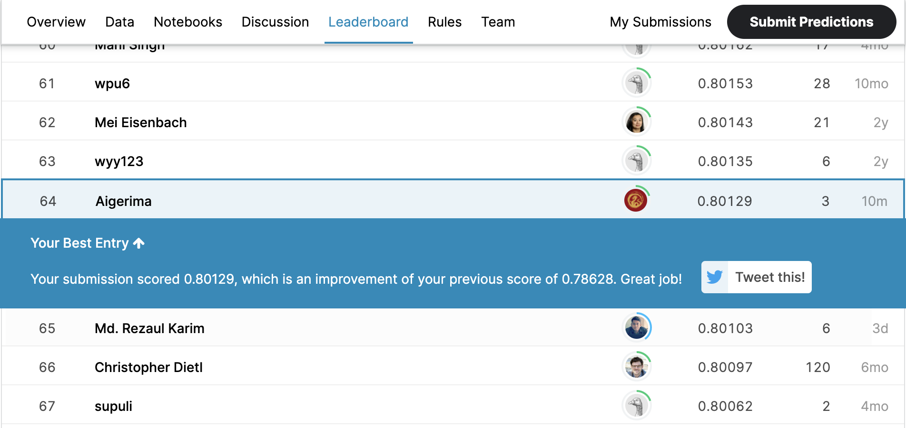

# Customer segmentation for Arvato
A capstone project for [Data Scientist Nanodegree Program by Udacity](https://www.udacity.com/course/data-scientist-nanodegree--nd025) and [Arvato](https://www.bertelsmann.com/divisions/arvato/)

## Goal
* to understand customer segments of a mail-order company 
* to find potential customers within the general population data
* to predict potential customers using Train and Test datasets
* to participate in a Kaggle competition 

## Getting started
You need an installation of Python, plus the following libraries:
* numpy
* pandas
* sklearn
* matplotlib
* seaborn
* pandas-profiling
* datetime
* xgboost

## Summary of findings
* Supervised and unsupervised models were applied to find potential customers and identify segments within the existing customers
* k-means clustering found 4 segments within the existing customers
* 226,218 people from the general population were identified as potential customers, which represent about 25% of the general population
* XGBClassifier showed the highest score of the test set on Kaggle, which is 0.80129 and put me at the top 22% on the leaderboard
* The probability to subscribe to the mailing service for each potential customer was calculated. On average, the probability to subscribe to the identified customers is about 7%. This low probability could be due to imbalanced model with a lack of positive classes in the train dataset and data sparsity. As the next step, I would balance the classes in the model and check again probabilities for the 226,218 people.

## Kaggle leaderboard

## Medium blog post
More detailed explaination of the work done for the project can be found in my [blog post on Medium](https://aigerimshopenova.medium.com/identify-potential-customers-with-unsupervised-and-supervised-machine-learning-5310a3455f8a?sk=ebf42e38097fbc13b9140d6ecd8ac23c).
